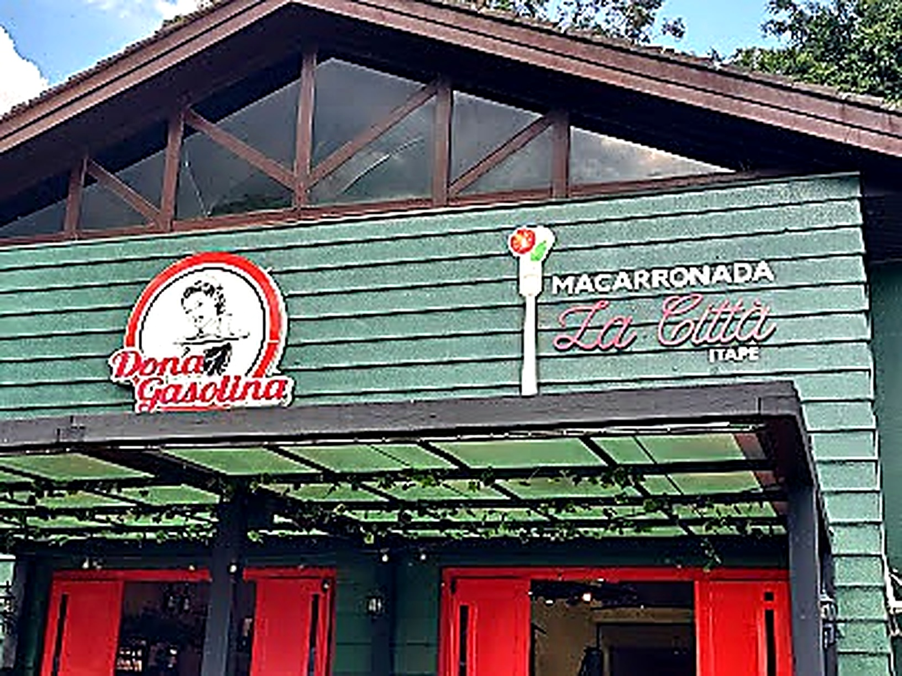

<div align="center">



<br/>
<br/>

# 🍝 Dona Gasolina

**Institutional website for an Italian restaurant in Itapetininga, Brazil.**  
Handcrafted with vanilla HTML, CSS & JavaScript — no frameworks, no dependencies.

[](https://developer.mozilla.org/en-US/docs/Web/HTML)
[](https://developer.mozilla.org/en-US/docs/Web/CSS)
[](https://developer.mozilla.org/en-US/docs/Web/JavaScript)
[](https://fontawesome.com)

</div>

---

## ✨ Features

- **Parallax Hero** — full-screen background with smooth scroll depth effect
- **Animated Menu** — filterable dish grid by category (pasta, meat, drinks, desserts)
- **Gallery Lightbox** — photo grid with click-to-expand modal
- **Infinite Ticker** — highlights bar with CSS-only loop animation
- **Reveal on Scroll** — IntersectionObserver-powered entrance animations
- **Mobile-First** — responsive layout with hamburger nav for all screen sizes
- **Zero Dependencies** — pure vanilla JS, no frameworks or build tools

---

## 📁 Project Structure

```
dona-gasolina/
├── index.html
└── assets/
    ├── css/
    │   └── style.css        # All styles, animations & responsive breakpoints
    ├── js/
    │   ├── images.js        # Image path map (keys → file references)
    │   └── main.js          # All site logic: menu, gallery, parallax, nav
    └── images/
        ├── dona_gasolina.jpg
        ├── lasagne.jpg
        ├── polpetone.jpg
        └── ...              # All dish & restaurant photos
```

---

## 🚀 Getting Started

No build step required. Just open in a browser:

```bash
# Clone the repository
git clone https://github.com/your-username/dona-gasolina.git

# Open locally
cd dona-gasolina
open index.html
```

> For local image loading to work correctly, serve via a local server:
> ```bash
> npx serve .
> # or
> python3 -m http.server 3000
> ```

---

## 🖼️ Adding or Replacing Images

All image references live in `assets/js/images.js` as a simple key-value map:

```js
const IMGS = {
  lasagne:   'assets/images/lasagne.jpg',
  polpetone: 'assets/images/polpetone.jpg',
  // ...
};
```

To swap an image: replace the file in `assets/images/` and update the path in `images.js`. No other changes needed.

---

## 🍽️ Adding Menu Items

Open `assets/js/main.js` and add an entry to the `menuItems` array:

```js
{
  key:      'nome_do_arquivo',   // matches a key in IMGS
  name:     'Nome do Prato',
  desc:     'Descrição do prato com ingredientes.',
  price:    'R$ 00,00',
  category: 'massas',           // massas | carnes | bebidas | sobremesas
  popular:  false,              // true shows the 🔥 Popular badge
}
```

---

## 📍 About the Restaurant

**Dona Gasolina** is an Italian restaurant located in Itapetininga – SP, Brazil.  
Rated **4.5 ★** on Google with over **652 reviews**.

> *Rua Fortunato Mazzei, 101 — Vila Maria, Itapetininga – SP*  
> *(15) 3271-0661 · Mon–Sat 11h–23h · Sun 11h–22h*

---

<div align="center">

made for joaomenkdev-cloud &nbsp;·&nbsp; © 2025 Dona Gasolina

</div>
